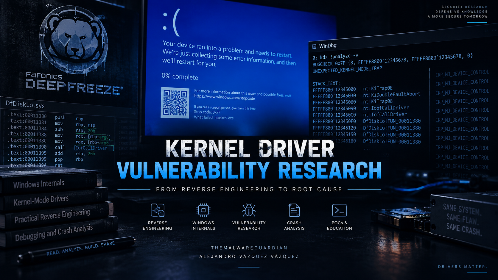

# ***Advisory: Kernel Stack Overflow via IOCTL Dispatch in DfDiskLo.sys***


<p align="center">
	
	
	
	
	
	
</p>


<p align="center">
	
</p>


---
---
---


## ***Table of Contents***

- [Overview](#Overview)
- [Affected Product](#AffectedProduct)
- [Vulnerability Summary](#VulnerabilitySummary)
- [Technical Root Cause](#RootCause)
- [Crash Analysis](#Crash)
- [Impact](#Impact)
- [Fix](#Fix)

---

- [Disclosure Timeline](#Disclosure)
- [References](#References)


---
---
---


<div id='Overview'/>

## ***🔎 Overview***

During a security research analysis of the Faronics Deep Freeze kernel-mode driver stack, a critical design flaw was identified in `DfDiskLo.sys` that causes an immediate and deterministic kernel stack overflow when any IOCTL is sent to the exposed device `\\.\DFDiskLow` from a local administrator process.

The vulnerability results in a *Blue Screen of Death (BSOD 0x7F - UNEXPECTED_KERNEL_MODE_TRAP, Double Fault)* and requires only a single API call to trigger. The crash is 100% reproducible across all test runs, producing an identical failure hash, confirming it is a reliable denial-of-service primitive.

| Field              | Value |
|--------------------|-------|
| Advisory ID        | ADV-001 |
| CVE                | Pending assignment |
| Product            | Faronics Deep Freeze Standard / Enterprise Workstation|
| URL                | [Standard](https://www.faronics.com/products/deep-freeze/standard) · [Enterprise](https://www.faronics.com/products/deep-freeze/enterprise) |
| Version Standard   | 9.00.020.5760 (latest as of 2026-05-26) |
| Version Enterprise | 10.10.220.5788 (latest as of 2026-05-26) |
| Component          | DfDiskLo.sys (kernel-mode driver) |
| Vulnerability      | Kernel Stack Overflow via Infinite IRP Recursion |
| CWE                | [CWE-400](https://cwe.mitre.org/data/definitions/400.html) · [CWE-674](https://cwe.mitre.org/data/definitions/674.html) |
| CVSS 3.1           | [AV:L/AC:L/PR:H/UI:N/S:C/C:N/I:N/A:H](https://www.first.org/cvss/calculator/3.1#CVSS:3.1/AV:L/AC:L/PR:H/UI:N/S:C/C:N/I:N/A:H) - 6.0 MEDIUM |
| Impact             | Local Denial of Service (BSOD) |
| Required Privilege | Local Administrator |
| Researcher         | [Alejandro Vázquez Vázquez](https://www.linkedin.com/in/vazquez-vazquez-alejandro) ([TheMalwareGuardian](https://github.com/TheMalwareGuardian)) |
| Discovered         | 2026-05-22 |


---
---
---


<div id='AffectedProduct'/>

## ***📦 Affected Product***

```
Driver   : C:\Windows\System32\drivers\DfDiskLo.sys
Product  : Faronics Deep Freeze Standard
Version  : 9.00.020.5760
Built    : 5/19/2024 2:59:41 PM
Size     : 0xC638 (50744 bytes)
OS       : Windows 11 x64

Driver   : C:\Windows\System32\drivers\DfDiskLo.sys
Product  : Faronics Deep Freeze Enterprise Workstation
Version  : 10.10.220.5788
Built    : 5/19/2024 2:59:41 PM
Size     : 0xC650 (50768 bytes)
OS       : Windows 11 x64
```

Version confirmation:
```powershell
PS> (Get-Item C:\Windows\System32\drivers\DfDiskLo.sys).VersionInfo
ProductVersion : 9.00.020.5760
FileVersion    : 9,00,20,5760

PS> (Get-Item C:\Windows\System32\drivers\DfDiskLo.sys).VersionInfo
ProductVersion : 10.10.220.5788
FileVersion    : 10,10,220,5788
```


---
---
---


<div id='VulnerabilitySummary'/>

## ***💀 Vulnerability Summary***

Sending **any IOCTL** to the device `\\.\DFDiskLow` from a local administrator process causes an immediate kernel stack overflow and system crash.

The root cause is a **fundamentally broken IRP dispatch table design**: `DfDiskLo.sys` assigns a single broken pass-through function (`FUN_00011380`) as the default handler for all 28 IRP major function slots in its dispatch table. This includes `IRP_MJ_DEVICE_CONTROL` (0x0E) - the standard entry point for all IOCTL communication from userland.

This handler unconditionally forwards every IRP to the next driver in the device stack via `IofCallDriver`. Because `DfDiskLo.sys` is attached to that same stack via `IoAttachDeviceToDeviceStack`, the forwarded IRP is dispatched back into `DfDiskLo.sys`, creating **infinite recursion**. Each recursive cycle consumes approximately **128 bytes (0x80)** of kernel stack. With only 24 KB available per kernel thread, the stack is exhausted in approximately **192 cycles**, triggering a Double Fault and an unrecoverable BSOD.

Critically, **the IOCTL code value is irrelevant** - any code produces the same crash because the bug exists in the dispatch table registration itself, before the IOCTL code is ever examined.


---
---
---


<div id='RootCause'/>

## ***🔬 Technical Root Cause***

### ***DriverEntry - Broken Default Handler for ALL IRP Slots***

Static analysis of `DfDiskLo.sys` in Ghidra reveals the driver initialization function (`FUN_0001a008`). All 28 IRP major function slots are filled with `FUN_00011380`, but only 6 are then overridden with proper handlers. `IRP_MJ_DEVICE_CONTROL` (0x0E) is **not** among them:

```c
// FUN_0001a008 - DriverEntry equivalent in DfDiskLo.sys

// Step 1: ALL 28 dispatch table slots assigned to broken default
undefined8 *puVar2 = (undefined8 *)(param_1 + 0x70);  // MajorFunction[0]
for (longlong lVar1 = 0x1c; lVar1 != 0; lVar1--) {
	*puVar2 = FUN_00011380;   // <-- broken pass-through for ALL 28 slots
	puVar2++;
}

// Step 2: Only 6 slots overridden with proper handlers
//         IRP_MJ_DEVICE_CONTROL (0x0E) is NOT here
*(code **)(param_1 + 0x148) = FUN_00017190;  // IRP_MJ_PNP        [0x1B]
*(code **)(param_1 + 0x120) = FUN_000115d4;  // IRP_MJ_POWER      [0x16]
*(code **)(param_1 + 0xe8)  = FUN_0001141c;  // IRP_MJ_INTERNAL_DEVICE_CONTROL [0x0F]
*(code **)(param_1 + 0x68)  = FUN_000174fc;  // IRP_MJ_CLEANUP    [0x12]
*(code **)(param_1 + 0x100) = FUN_00017678;  // IRP_MJ_CLOSE      [0x02]
*(code **)(param_1 + 0x70)  = FUN_00017678;  // IRP_MJ_CREATE     [0x00]
```

### ***FUN_00011380 - The Broken Pass-Through Handler (offset +0x13E7)***

```c
int FUN_00011380(longlong param_1,   // DEVICE_OBJECT*
				longlong param_2)   // IRP*
{
	longlong lVar1 = *(longlong *)(param_1 + 0x40);  // DeviceExtension

	int iVar2 = IoAcquireRemoveLockEx(lVar1 + 0x28, param_2, ..., 0x20);
	if (iVar2 < 0) {
		IofCompleteRequest(param_2, 0);
		return iVar2;
	}

	// Advances IO_STACK_LOCATION to next slot
	*(char *)(param_2 + 0x43)     += 1;
	*(longlong *)(param_2 + 0xb8) += 0x48;

	// ---- THE BUG ----
	// Forwards IRP to AttachedDevice.
	// AttachedDevice routes back into DfDiskLo.sys.
	// INFINITE RECURSION: ~192 cycles, 128 bytes/cycle, 24KB stack total.
	iVar2 = IofCallDriver(*(undefined8 *)(lVar1 + 0x18), param_2);
	// ---- END BUG ----

	IoReleaseRemoveLockEx(lVar1 + 0x28, param_2, 0x20);
	return iVar2;
}
```

### ***Recursive Call Chain***

```
[Userland]  DeviceIoControl(hDev, ANY_IOCTL_CODE, ...)
            |
            v  IRP_MJ_DEVICE_CONTROL (0x0E)
            nt!IopfCallDriver+0x56          [ -0x40 bytes of stack ]
            |
            v  MajorFunction[0x0E] = FUN_00011380
            DfDiskLo!FUN_00011380 (+0x13E7) [ -0x48 bytes of stack ]
            |  IofCallDriver(AttachedDevice, IRP)
            |  AttachedDevice -> back to DfDiskLo (circular stack)
            v
            nt!IofCallDriver+0x13           [ -0x30 bytes of stack ]
            |
            v
            DfDiskLo!FUN_00011380 (+0x13E7) [ cycle repeats, -0x80 bytes total/cycle ]
            |
            ...  [ ~192 cycles ]
            |
            v
            nt!IopfCallDriver               [ #SS Stack Segment Fault ]
            |
            v
            [ No stack available for exception handler ]
            |
            v
            #DF Double Fault  ->  BSOD 0x7F UNEXPECTED_KERNEL_MODE_TRAP
```


---
---
---


<div id='Crash'/>

## ***💥 Crash Analysis***

### ***WinDbg Bugcheck Analysis***

```
BUGCHECK    : 0x7F (UNEXPECTED_KERNEL_MODE_TRAP)
Arg1        : 0x00000008  (EXCEPTION_DOUBLE_FAULT -- x86/x64 trap #8)
Arg2        : 0xfffff80253497e50
Arg3        : 0xfffff300dbca1fd0  (RSP at time of fault)
Arg4        : 0xfffff802c0d741f6  (nt!IopfCallDriver+0x56)

SYMBOL_NAME       : DfDiskLo+13e7
IMAGE_NAME        : DfDiskLo.sys
PROCESS_NAME      : ExploitCrash.exe
STACK_OVERFLOW    : Stack Limit fffff300dbca2000
FAILURE_BUCKET_ID : 0x7f_8_DfDiskLo!unknown_function
FAILURE_HASH      : {8fad4b6b-1c95-746a-16ad-6364a3fe818d}
```

### ***Stack Trace at Crash***

```
# Child-SP           RetAddr             Call Site
00 fffff300`dbca1fd0 fffff802`c0d74173 : nt!IopfCallDriver+0x56
01 fffff300`dbca2010 fffff802`54f313e7 : nt!IofCallDriver+0x13
02 fffff300`dbca2040 00000000`00000000 : DfDiskLo+0x13e7
```

Only 3 frames visible - all deeper frames were consumed by the recursion before the stack was exhausted.

### ***Stack Memory - 0x80-byte Recursion Pattern***

```
dps rsp output (WinDbg):

fffff300`dbca2038  DfDiskLo+0x13e7       <- cycle N
fffff300`dbca20b8  nt!IofCallDriver+0x13 <- cycle N   (+0x80 bytes)
fffff300`dbca20e8  DfDiskLo+0x13e7       <- cycle N+1 (+0x80 bytes)
fffff300`dbca2168  nt!IofCallDriver+0x13 <- cycle N+1 (+0x80 bytes)
fffff300`dbca2198  DfDiskLo+0x13e7       <- cycle N+2 (+0x80 bytes)
```

### ***Stack Usage***

```
!stackusage output:

nt!IopfCallDriver : 0x40 bytes
nt!IofCallDriver  : 0x30 bytes
DfDiskLo+0x13e7   : NOT REPORTED  <-- consumed entire remaining stack

Total visible : 0x70 bytes
```

`DfDiskLo+0x13e7` does not appear in `!stackusage` because the kernel's own stack accounting ran out of stack before it could record the driver's frame - the definitive indicator that the driver exhausted the thread stack.

### ***Reproduction Consistency***

The vulnerability has been reproduced across **multiple independent test runs**, all producing the **identical `FAILURE_HASH {8fad4b6b-1c95-746a-16ad-6364a3fe818d}`**, confirming the crash is deterministic and not environment-dependent.


---
---
---


<div id='Impact'/>

## ***⚠️ Impact***

A local administrator can crash any Windows system running Faronics Deep Freeze by sending a single IOCTL. The crash is:

- Immediate: no delay, no race condition, no special state required.
- Deterministic: 100% reproducible, identical crash signature every time.
- Unrecoverable: system must be rebooted, no soft recovery possible.
- Repeatable: can be triggered again after every reboot.

### ***Attack Scenarios***

Deep Freeze is specifically deployed as an endpoint protection solution in high-availability environments. An attacker or malicious insider with local administrator access can: ***Repeatedly crash machines after each reboot to deny service indefinitely.***


---
---
---


<div id='Fix'/>

## ***🛠️ Fix Recommendation***

### ***Option 1 - Register an Explicit IRP_MJ_DEVICE_CONTROL Handler***

```c
// In DriverEntry, add an explicit handler for IOCTL dispatch:
DriverObject->MajorFunction[IRP_MJ_DEVICE_CONTROL] = DeviceControlHandler;

NTSTATUS DeviceControlHandler(PDEVICE_OBJECT DevObj, PIRP Irp) {
	PIO_STACK_LOCATION stack = IoGetCurrentIrpStackLocation(Irp);
	ULONG code = stack->Parameters.DeviceIoControl.IoControlCode;

	switch (code) {
		// Add cases for known/supported IOCTLs here
		default:
			// Reject unknown codes - do NOT forward
			Irp->IoStatus.Status      = STATUS_INVALID_DEVICE_REQUEST;
			Irp->IoStatus.Information = 0;
			IoCompleteRequest(Irp, IO_NO_INCREMENT);
			return STATUS_INVALID_DEVICE_REQUEST;
	}
}
```

### ***Option 2 - Add a Recursion Depth Guard in FUN_00011380***

```c
// Before forwarding the IRP, verify stack depth:
if (IoGetCurrentIrpStackLocation(Irp)->MinorFunction <= 1) {
	Irp->IoStatus.Status = STATUS_TOO_MANY_COMMANDS;
	IoCompleteRequest(Irp, IO_NO_INCREMENT);
	return STATUS_TOO_MANY_COMMANDS;
}
```

### ***Option 3 - Review Device Stack Attachment***

Review the `IoAttachDeviceToDeviceStack` usage in `FUN_00017008` to ensure the driver is not creating a circular device stack reference that causes the IRP to be re-dispatched into itself.


---
---
---


<div id='Disclosure'/>

## ***📅 Disclosure Timeline***

| Date          | Event                                                      |
|---------------|------------------------------------------------------------|
| 2026-05-22    | Vulnerability discovered during independent security research |
| 2026-05-22    | First BSOD reproduced with multiple IOCTLs                 |
| 2026-05-26    | Isolated single-IOCTL reproduction confirmed               |
| 2026-05-26    | Root cause confirmed via WinDbg and Ghidra static analysis  |
| 2026-05-26    | Full technical report and advisory prepared                 |
| 2026-05-26    | Initial vendor contact submitted with full ZIP package containing the report, PoC, and supporting materials |
| 2026-05-29    | Submission re-sent with PoC and README after original ZIP appeared to be blocked or filtered |
| 2026-05-29    | Vendor acknowledged receipt (Faronics Support, Ticket #8921087) |
| 2026-07-16    | Vendor confirmed fix implemented and undergoing QA testing  |
| 2026-09-05    | Researcher followed up requesting patched version and coordinating public disclosure |
| 2026-09-08    | Vendor responded: fix still in QA, no release date, requested hold on public disclosure |
| 2026-09-12    | CVE ID requested from MITRE - 90-day responsible disclosure window exceeded (109 days) |


---
---
---


<div id='References'/>

## ***📚 References***

- [CWE-400: Uncontrolled Resource Consumption](https://cwe.mitre.org/data/definitions/400.html)
- [CWE-674: Uncontrolled Recursion](https://cwe.mitre.org/data/definitions/674.html)
- [WDK IRP Major Function Codes](https://learn.microsoft.com/en-us/windows-hardware/drivers/kernel/irp-major-function-codes)
- [MSRC Driver Security Guidance](https://msrc.microsoft.com/blog/2021/09/kernel-driver-security/)
- [WDK Driver Security Checklist](https://learn.microsoft.com/en-us/windows-hardware/drivers/driversecurity/driver-security-checklist)


---
---
---


<p align="center">
	<i>Reported responsibly to support@faronics.com - 90-day disclosure policy applies.</i><br>
</p>
